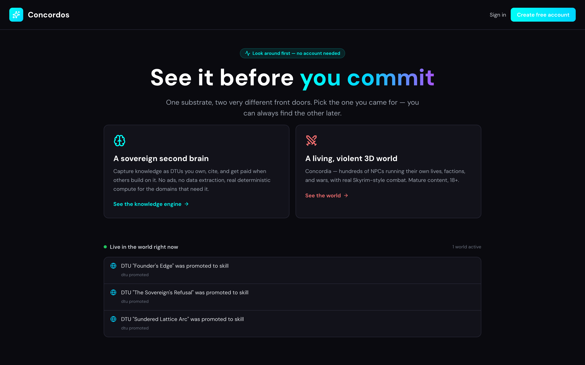
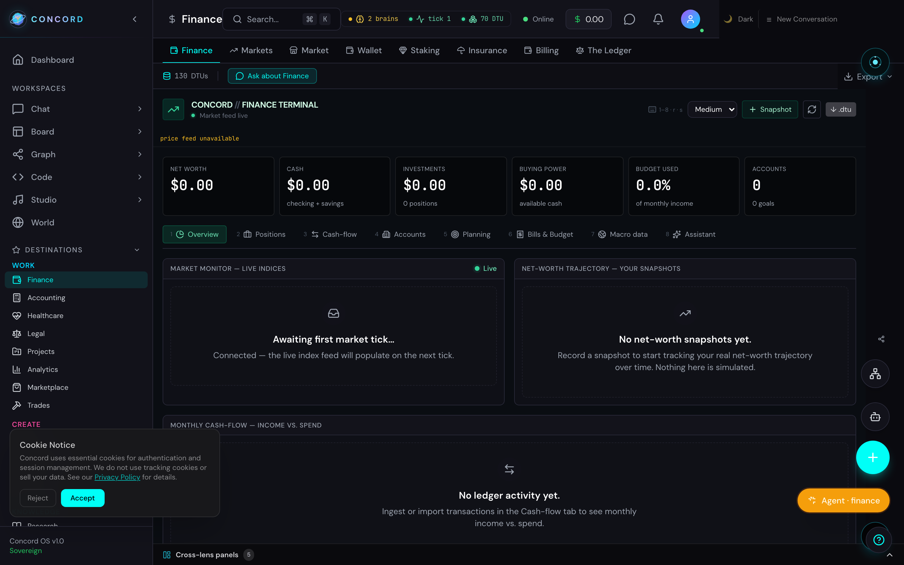
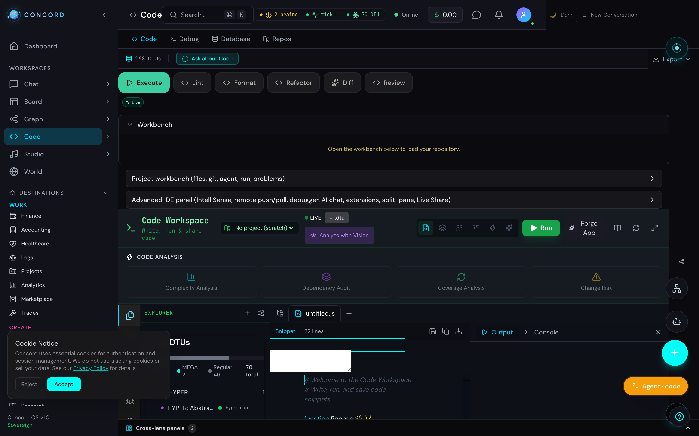
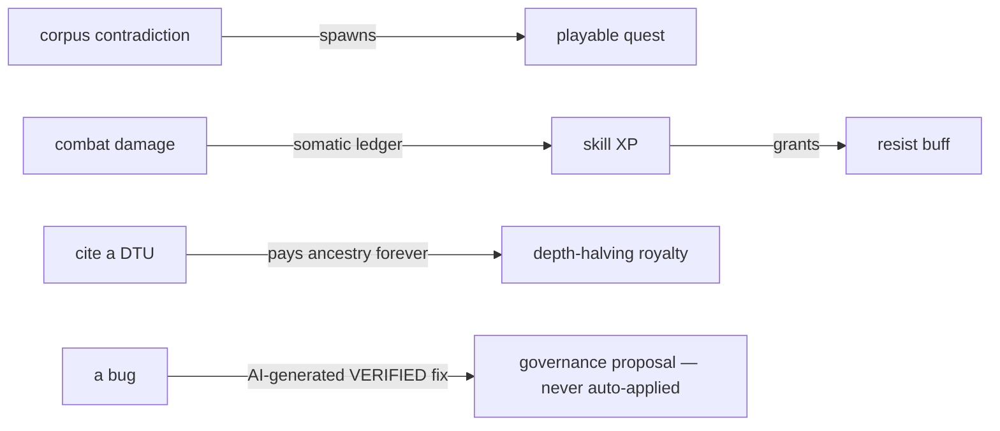
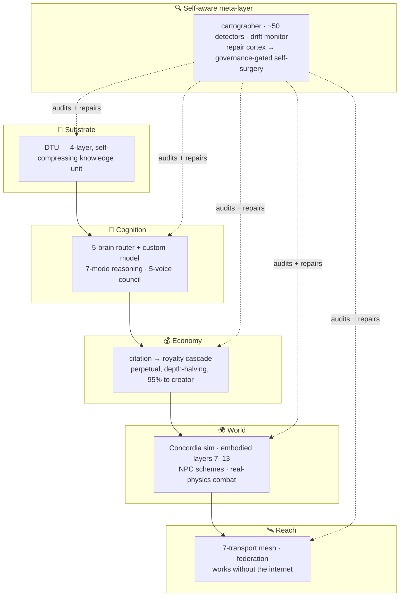

<div align="center">

# 🜂 Concord Cognitive Engine

### AI that shows its receipts.

**A verified-compute knowledge engine fused with a creator-economy world platform — and a layer that audits and repairs itself.** Most AI tools generate. Concord generates *and verifies, attributes, and remembers.*

**Wolfram × Roblox, built by one person.**

<br/>

### [→ Walk in the door: concord-os.org/explore](https://concord-os.org/explore)

*Live. No signup. Nothing staged for a demo — it's the same substrate real users are on.*

<br/>

[](https://concord-os.org/explore)

<br/>


</div>

---

<details>
<summary><b>Contents</b></summary>

- [What it is](#what-it-is)
- [Try it in 5 minutes](#try-it-in-5-minutes)
- [Why it's different](#why-its-different)
- [For investors and partners](#for-investors-and-partners)
- [The receipts](#the-receipts)
- [Architecture](#architecture-from-altitude)
- [Maturity](#maturity-honest)
- [License](#license)
- [Repo map](#repo-map)

</details>

---

## What it is

One knowledge substrate — the **DTU** (a 4-layer, self-compressing knowledge unit) — expressed through **267 domain "lenses,"** each of which reads as the app it replaces (a Bloomberg terminal, a VS Code shell, an Ableton timeline) while sharing one macro spine and one economy.

Welded to that:

- **A citation economy that pays you.** Cite a DTU and its whole ancestry earns a perpetual, depth-halving royalty. 95% goes to creators.
- **Real deterministic compute.** A symbolic CAS, direct-stiffness FEA, a gate-based quantum statevector simulator, orbital mechanics, double-entry accounting, an epidemiology sim — it *computes* the answer instead of hallucinating it.
- **A world that runs without you.** Concordia: hundreds of NPCs living their own lives, forming factions, running schemes, waging wars, with real Skyrim-style combat. 18+.
- **A layer that distrusts itself.** A cartographer that maps its own anatomy every pass, ~50 detectors on a CI baseline-ratchet, a drift monitor watching for six ways the corpus can lie to itself, and a repair cortex that proposes its own fixes but **cannot apply them unsupervised** — every code change routes through a governance gate.
- **Reach without the internet.** A 7-transport mesh + federation layer.

In a market where the bottleneck shifted from *generating* to *trusting*, **verification is the product.**

Fuller argument: [`docs/WHY_CONCORD_IS_DIFFERENT.md`](docs/WHY_CONCORD_IS_DIFFERENT.md)

---

## Try it in 5 minutes

**Fastest — no install:** open **[concord-os.org/explore](https://concord-os.org/explore)**, then:

1. Open the **Finance** lens — it's a real tabbed terminal, not a chat box.
2. Go to **Forge**, create a DTU (any note).
3. Cite it from a second DTU. Watch the royalty cascade fire in the **Ledger**.
4. Or skip the tour and [**watch the world live**](https://concord-os.org/spectate/concordia-hub) — a read-only real-time feed, no account.

**Run it yourself:**

```bash
git clone https://github.com/ConcordDev/concord-cognitive-engine
cd concord-cognitive-engine

cd server && npm install && npm run migrate && npm start      # :5050
cd ../concord-frontend && npm install && npm run dev          # :3000
# or the full stack (backend + frontend + 5 Ollama brains + nginx/redis/qdrant/prometheus):
docker-compose up
```

Production needs `JWT_SECRET`. Running the frontend standalone? Copy `concord-frontend/.env.example` → `.env.local` first. Realtime needs a WebSocket-aware proxy in front (nginx config included) — Next's standalone server does not forward WS upgrades. Full setup: [`DEPLOYMENT.md`](DEPLOYMENT.md).

Each lens reads as the app it replaces — a Bloomberg-style terminal, a VS Code shell — while sharing one substrate, one macro spine, one economy:

| Finance lens | Code lens |
|---|---|
| [](https://concord-os.org/lenses/finance) | [](https://concord-os.org/lenses/code) |

<sub>Captured live from concord-os.org on a brand-new account (hence the empty ledgers / "connecting" feeds — nothing seeded, nothing faked). Regenerate against any instance with `node scripts/capture-screenshots.mjs`.</sub>

---

## Why it's different

Every incumbent owns exactly **one** vector. None ship the intersection.

| Vector | Who owns it | Concord |
|---|---|---|
| Grounded / verified | Perplexity, Wolfram | `reason.verify` + citation floors + a drift monitor |
| General capability | ChatGPT | 5-brain router + ~10.6k macros |
| Private / local | Ollama | local brains + consent gates + a no-leak invariant |
| Controllable memory | Notion | DTU substrate + scope/consent gates |
| Owned economy | *(unclaimed)* | 95%-to-creator citation royalties |

The moat isn't any one novelty — it's that they're **the same fabric**. The knowledge graph, the economy, the game, and the codebase's own self-repair are one system:



Copying a primitive is easy. Copying the web is the years-long part. — [the full thesis](docs/WHY_CONCORD_IS_DIFFERENT.md) · [the ~326 catalogued novelties](docs/NOVELTY_INVENTORY.md)

---

## For investors and partners

**Stage:** Live at [concord-os.org](https://concord-os.org), pre-revenue. Built by **Concord Dev** — one founder, AI-accelerated, ~2.7M lines of authored source and a running product. Seeking design partners and pre-seed conversations.

**Why now.** Agents are shipping into everything in 2026, and the thing blocking adoption isn't capability — it's that you can't trust unchecked output in a workflow that matters. "Deterministic compute as a tool an agent can call, with a citation trail" is an unclaimed wedge. Concord is a working instance of it.

**The moat, in one place:**
- **Coupled fabric** (above) — the integration is the hard part, not the parts.
- **Self-auditing by construction** — the repo's own tooling polices its honesty; that's why every number below reproduces from a command.
- **License** — source-available under CSL-CE 1.0: the community can run and learn from it; hosting, the marketplace, and the global network are commercially reserved. A commercial licensing path exists. ([`LICENSE.txt`](LICENSE.txt) · dependency/model license posture: [`docs/LICENSING.md`](docs/LICENSING.md))

**Next ~6 months:** move the public deployment off a single shared box onto dedicated infra ([`docs/OFF_MAC_MIGRATION_BLUEPRINT.md`](docs/OFF_MAC_MIGRATION_BLUEPRINT.md)); take the six built connectors live (needs only operator OAuth credentials); open the developer platform (MCP server, signed plugin gallery, and SDK are built — [`docs/DEVELOPER_PLATFORM_GTM.md`](docs/DEVELOPER_PLATFORM_GTM.md) — adoption is the missing piece, not the build).

**Contact:** Concord Dev — [dutchtropez@gmail.com](mailto:dutchtropez@gmail.com)

---

<div align="center">

## The receipts

*Everything below reproduces from a command. That's the point.*

</div>

---

### By the numbers

| Metric | Reproduce |
|---|---|
| Authored source (~2.7M LOC, excl. content) | `npm run count-loc` |
| Frontend lenses · backend domains | `ls -d concord-frontend/app/lenses/*/` · `ls server/domains/*.js` |
| Macro domains · `(domain, macro)` pairs (~558 · ~10.6k) | `node scripts/verify-lens-backends.mjs` |
| DB tables · numbered migrations | `cd server && npm run cartograph:static` · `ls server/migrations/[0-9]*.js` |
| Heartbeats driving the live sim (~143) | `grep -roh "registerHeartbeat(..." server/ --exclude-dir=tests \| sort -u \| wc -l` |
| AI brains | 5 (4 cognitive + vision) — `server/lib/brain-config.js` |
| Tests passing | `cd server && npm test` |
| Detector board | 0 critical; a working backlog of high/medium the CI ratchet blocks *new* regressions against — `cd server && node scripts/run-detectors.js` |

> `npm run check-doc-claims` re-runs the reproduction command behind every numeric claim in `docs/` and fails the build on drift. Exact current values: [`docs/STATE_OF_CONCORD.md`](docs/STATE_OF_CONCORD.md).

---

## Architecture, from altitude

Concentric rings — inner is the substrate, outer is Concord acting on itself and the world.



**How a request flows:** `POST /api/lens/run` → 3-gate permission → `runMacro` (routes to a brain *or* deterministic compute) → read/mint DTUs → a citation fires the royalty cascade → `{ ok, result }` — verified, attributed, remembered.

Deeper: [`ARCHITECTURE.md`](ARCHITECTURE.md) · [`API.md`](API.md)

---

## Maturity, honest

| Proven | In progress | Research-grade |
|---|---|---|
| Deployed and live; deploy path repeatable and driven by real user requests. | No literal heavy-load run against production yet — "proven under real traffic" is future work. Load *shedding* (admission control under measured event-loop lag) is built. | The Foundation signal-layer (signal tomography, EM-fingerprint identity) and some emergent-civilization systems: built, wired, running — not yet validated against real physical conditions. |
| A dedicated audit pass hunted concurrent-load, high-volume, and money-at-volume failure modes and **fixed real instances of each** — a connection-dropping root cause, LLM-pipeline truncation, a wallet-drain IDOR, an authenticated RCE — rather than leaving them theoretical. That audit process *is* the self-auditing thesis in practice. | Public deployment currently shares one box with a dev environment — being moved to dedicated infra ([blueprint](docs/OFF_MAC_MIGRATION_BLUEPRINT.md)). | The six marquee connectors are code-complete and contract-tested; going live needs operator OAuth credentials, not code. |
| Every lens is judged as a standalone product against its category leader; a detector mechanically checks all 267 for auto-generated-scaffold patterns (current: 0). | Some `docs/` numbers drift between refreshes — `check-doc-claims` catches it in CI; trust the command over any prose, including this file. | The developer ecosystem: infrastructure built (MCP server, signed plugin gallery, SDK), external adoption not yet started. |

Full caveats, with commit-level evidence: [`docs/WHY_CONCORD_IS_DIFFERENT.md`](docs/WHY_CONCORD_IS_DIFFERENT.md#honest-caveats-what-it-is-not) · measured LIVE-vs-overclaim: [`docs/STACK_REALITY.md`](docs/STACK_REALITY.md).

---

## License

**Concord Source License – Community Edition (CSL-CE 1.0)** — source-available, **not** OSI open-source. See [`LICENSE.txt`](LICENSE.txt).

You **may**: run and self-host privately, study and modify for non-commercial research/education, create DTUs for private use, contribute back via PR, fork for personal/research use.

You **may not** without a written grant: sell or commercially distribute it, offer it as a hosted service, operate a derivative marketplace or a competing global network, or monetize DTUs / lineage graphs / Concord-derived assets. Commercial licensing is available — contact the owner.

"Concord," "ConcordOS," "DTU," "Hyper-DTU," and associated marks are not licensed. Commercial licensing: [dutchtropez@gmail.com](mailto:dutchtropez@gmail.com).

---

## Repo map

| Path | What's there |
|---|---|
| `server/server.js` | The monolith by deliberate choice (IP protection) — every route independently dispatched, background sim on a strictly-sequential per-module-isolated tick, front-door admission control under event-loop lag |
| `server/domains/` | 434 domain engines (the lens backends) |
| `server/emergent/` | 237 simulation modules (the living layer) |
| `server/lib/` | ~1,280 subsystem libs (brains, DTUs, embodied layers, repair cortex, detectors) |
| `server/migrations/` | 440 numbered migrations |
| `concord-frontend/` | Next.js 16 — 267 lenses, the lens-runtime framework, Concordia 3D + a real Godot client |
| `concord-mobile/` | React Native — real BLE / WiFi-P2P / NFC, mesh-aware, offline-first |
| `sdk/` | Publishable developer SDK + examples |
| `docs/` | Strategic + verified docs |

**Docs worth reading:** [`WHY_CONCORD_IS_DIFFERENT.md`](docs/WHY_CONCORD_IS_DIFFERENT.md) (the thesis) · [`NOVELTY_INVENTORY.md`](docs/NOVELTY_INVENTORY.md) (every novelty → a source file) · [`STATE_OF_CONCORD.md`](docs/STATE_OF_CONCORD.md) (verified snapshot) · [`SCIFI_FEASIBILITY_MAP.md`](docs/SCIFI_FEASIBILITY_MAP.md) (real vs aspirational) · [`SECURITY.md`](SECURITY.md)

---

<div align="center">

**The artifact is the pitch.** Clone it, run the commands, read the receipts — or just [walk in the door](https://concord-os.org/explore).

*The bottleneck in AI shifted from generating to trusting. That's the bet — and it's already built.*

</div>
