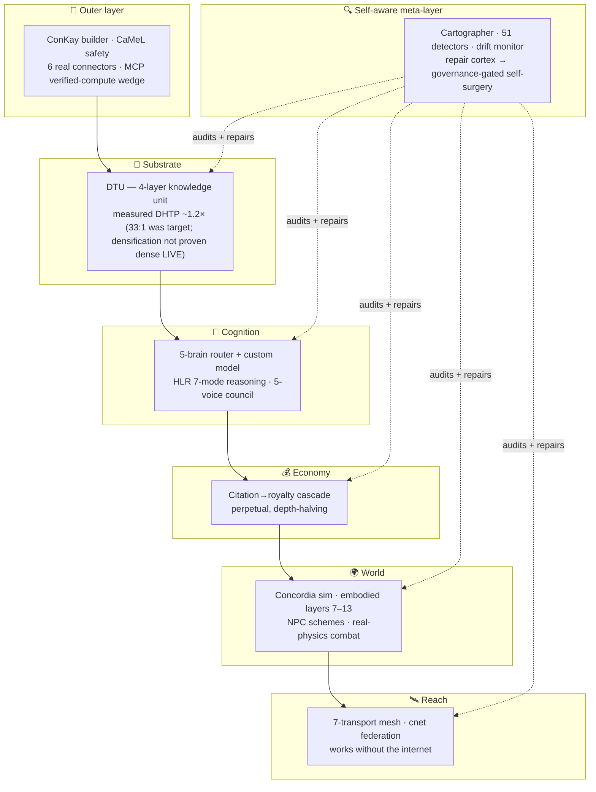
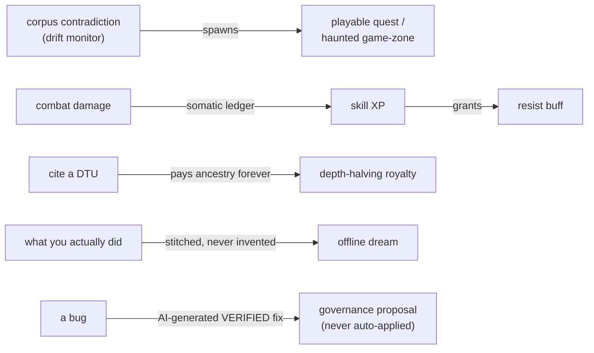
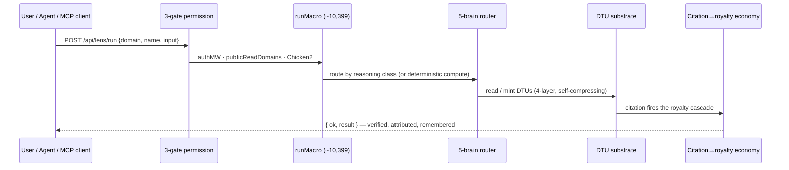

> See [`docs/STACK_REALITY.md`](docs/STACK_REALITY.md) for measured LIVE vs OVERCLAIM (2026-09-05).

<div align="center">

# 🜂 Concord Cognitive Engine

### AI that shows its receipts.

**Proves what it claims. Refuses what it can't. Remembers everything — and pays you when your work gets built on.**

</div>

---

## See it running — no signup, no waiting


Most platforms ask you to trust the pitch first and see the product later. Don't. Walk in yourself, right now, with no account:

**[→ concord-os.org/explore](https://concord-os.org/explore)** — a live public entry point, forked into whichever half you're actually here for:

- **[The knowledge engine](https://concord-os.org/explore/engine)** — DTUs, a citation economy that pays you, real deterministic compute (a symbolic CAS, structural FEA, orbital mechanics) instead of an LLM guessing the answer.
- **[The living world](https://concord-os.org/explore/world)** — Concordia, hundreds of NPCs running their own factions, schemes, and wars, with real Skyrim-style combat. Mature content, 18+.

Or skip the tour and just [**watch the world live**](https://concord-os.org/spectate/concordia-hub) — a read-only feed of what's happening right now, updating in real time, no account, no download. Nothing here is staged for a demo. It's the same substrate real users are on.

---

Most AI tools **generate**. Concord generates **and verifies, attributes, and remembers** — then audits and repairs *itself*. One knowledge substrate (the **DTU**), expressed through 266 domain "lenses," welded to a creator economy, a 3D civilization simulator, and a mesh network that works without the internet.

| | |
|---|---|
| 🧠 **A second brain that compounds** | Knowledge you own, cited, and growing into a living substrate — get paid when someone else builds on it. |
| 🌍 **A world that runs without you** | Hundreds of NPCs living their own lives, forming factions, waging wars, whether you're watching or not. |
| 🔬 **Real math, not a guess** | A symbolic CAS, direct-stiffness FEA, orbital mechanics, double-entry accounting — it computes the answer instead of hallucinating it. |
| 🔍 **It audits itself** | 51 detectors, a drift monitor, and a repair cortex that proposes its own fixes but can't apply them unsupervised. |

In a market where the bottleneck has shifted from *generating* to *trusting*, **verification is the product.**

[**Why it's different →**](docs/WHY_CONCORD_IS_DIFFERENT.md) &nbsp;·&nbsp; [**The 326 novelties →**](docs/NOVELTY_INVENTORY.md) &nbsp;·&nbsp; [**Verified snapshot →**](docs/STATE_OF_CONCORD.md)


---

## Why it's different — the white space

Every incumbent owns exactly **one** vector. None ship the intersection. *(full argument: [`docs/WHY_CONCORD_IS_DIFFERENT.md`](docs/WHY_CONCORD_IS_DIFFERENT.md))*

| Vector | Who owns it | Concord |
|---|---|---|
| Grounded / verified | Perplexity, Wolfram | ✅ `reason.verify` + citation floors + drift monitor |
| General capability | ChatGPT | ✅ 5-brain router + ~10,399 macros |
| Private / local | Ollama | ✅ local brains + consent gates + no-leak invariant |
| Controllable memory | Notion | ✅ DTU substrate + scope/consent gates |
| Owned / no-subscription | *(unowned)* | ✅ free + local + 95%-to-creator economy |

The closest one-liner: **Wolfram × Roblox, built by one person** — a verified-compute knowledge engine fused with a creator-economy world platform, plus a self-auditing layer neither has.

---

<div align="center">

## ↓ Everything below this line is the receipts ↓

*Numbers, architecture, and internals — for the people who want to check, not just read.*

</div>

---

## By the numbers (reproduce every one)

| Metric | Value | Reproduce |
|---|---|---|
| Authored source | **~2.62M LOC** (4.37M incl. content) | `npm run count-loc` |
| Frontend lenses | **266** | `ls -d concord-frontend/app/lenses/*/` |
| Backend domains | **420** | `ls server/domains/*.js` |
| Macro domains · pairs | **547 · ~10,399** | `node scripts/verify-lens-backends.mjs` |
| DB tables · migrations | **765 · 398** | `cd server && npm run cartograph:static` |
| Heartbeats (live sim) | **140** | cartographer / `registerHeartbeat` grep |
| AI brains | **5** (4 cognitive + vision) | `server/lib/brain-config.js` |
| Catalogued novelties | **326 / 34 groups** | [`docs/NOVELTY_INVENTORY.md`](docs/NOVELTY_INVENTORY.md) |
| Tests passing | **38,371** | `cd server && npm test` |
| Code-health board | **71 findings · 0 critical** | `cd server && node scripts/run-detectors.js` |

> **Everything here is falsifiable by design.** `npm run check-doc-claims` re-runs the reproduction command behind every numeric claim in the docs and fails on drift.

---

## The architecture, from altitude

Concord is best read as **concentric rings** — inner rings are the substrate, outer rings are Concord acting on itself and the world.



---

## The moat is the *couplings*

The 326 novelties matter less than how they're wired to each other. Anyone can copy a primitive; copying the web is the years-long part.



The knowledge graph, the economy, the game, and the codebase's own self-repair are **the same fabric.** No incumbent has that.

---

## The rarest property: self-aware by construction

Concord carries a **running model of itself** and acts on it — the part that's genuinely hard to find anywhere:

- **Cartographer** auto-maps its own anatomy (765 tables, 140 heartbeats, ~10,399 macros) every pass.
- **51 detectors + a baseline-ratchet** audit its own honesty — CI fails on any new high/critical. *(It's why this repo's docs are falsifiable.)*
- **Drift monitor** watches the corpus for 6 ways the system can lie to itself.
- **Repair cortex** proposes its own surgery but **can't perform it unsupervised** — every code fix routes through a governance gate.

A system engineered to **distrust itself** is the right architecture for the one thing the AI market actually lacks.

---

## Under-appreciated strengths

**Real deterministic compute — not LLM-guessed.** A symbolic CAS, direct-stiffness **FEA**, a gate-based **quantum statevector simulator**, stoichiometry, orbital mechanics, **causal-closure analysis**, NEC electrical code, aircraft weight & balance, k-anonymity, double-entry accounting, an epidemiology sim. *(Inventory groups O · U · AH.)* This is the R&D wedge: an agent that **computes the answer instead of hallucinating it.**

**Real connectors.** All six marquee connectors are code-complete: Gmail + Google Calendar are real two-way (send/push + read/inbox/pull); Slack, Sheets, GitHub, and Notion are built and contract-tested on the same SSRF-guarded chokepoint with encrypted per-user tokens. Going live on any of them needs only operator-supplied OAuth client credentials.

---

## How a request flows



---

## More screenshots

A lens — Finance (left), Code (right). Each lens reads as the app it replaces (a
trading dashboard, a VS Code shell) while sharing one substrate, one macro spine,
one economy:

| Finance | Code |
|---|---|
|  |  |

> Captured from a live local instance via [`scripts/capture-screenshots.mjs`](scripts/capture-screenshots.mjs)
> (Playwright, against the cached chromium). **Stale as of this note** — both images
> predate a since-landed declutter pass: Finance shipped a full flagship rebuild
> (real Bloomberg-terminal-style tabbed UI, zero raw capability-list scaffold) and
> Chat/every other lens had the dead `UniversalActions`/`LensFeaturePanel`
> button-wall scaffold removed repo-wide. The screenshots above show an older,
> busier UI than what ships today. Regenerating them needs a real running,
> authenticated instance with seeded data — out of reach for an unattended sandbox
> session — so they're flagged here rather than left to silently misrepresent the
> current UI. Point the script at any running instance to regenerate
> `docs/images/*.png`:
>
> ```bash
> CONCORD_URL=https://your-instance CONCORD_USER=you@example.com CONCORD_PASS=… \
>   node scripts/capture-screenshots.mjs
> ```

---

## Maturity — honest

**Deployed and live at [concord-os.org](https://concord-os.org) — deployment is proven and repeatable.** This backlog is built and shipped through that deploy path, and real users' requests drive the work. A dedicated audit pass went looking specifically for concurrent-load, high-volume-traffic, and money-at-volume failure modes and fixed real instances of each (a connection-dropping root cause, LLM-pipeline truncation, a critical wallet-drain IDOR, an authenticated RCE, and more) rather than leaving them theoretical, and a real admission-control layer sheds excess load under measured event-loop lag instead of degrading uncontrolled — but no literal heavy-load run has been executed against the live deployment, so "proven under real traffic" remains future work, not a claim made here. A handful of systems (the Foundation signal-layer, some emergent-civilization systems) are research-grade — built, wired, and running today, just not yet validated against real-world physical conditions specifically. Depth isn't papered over with generic scaffolding either: a dedicated detector mechanically checks every lens for auto-generated-template patterns, and the current count is 0/265. *(Full caveats: [`docs/WHY_CONCORD_IS_DIFFERENT.md`](docs/WHY_CONCORD_IS_DIFFERENT.md) · [`docs/STATE_OF_CONCORD.md`](docs/STATE_OF_CONCORD.md).)*

---

## Quickstart

```bash
# Backend
cd server && npm install && npm run migrate && npm start      # :5050
# Frontend
cd concord-frontend && npm install && npm run dev             # :3000
# Full stack (backend + frontend + 5 Ollama brains + nginx/redis/qdrant/prometheus)
docker-compose up
```
Requires `JWT_SECRET` in production. Five Ollama instances default to models originally sized for an RTX PRO 4500 Blackwell; the real deployed target is a single NVIDIA A40 (48GB), with per-deployment overrides tuned for that box (override any model via env). See [`docs/CONNECTORS_GO_LIVE.md`](docs/CONNECTORS_GO_LIVE.md) for connector setup.

Running the frontend standalone (`npm run dev`, not `docker-compose up`)? Copy
`concord-frontend/.env.example` to `concord-frontend/.env.local` first — an
unconfigured `NEXT_PUBLIC_API_URL`/`NEXT_PUBLIC_SOCKET_URL` is the #1 cause of
a persistent "Connection lost" banner in dev (the frontend defaults to the
backend's `:5050` dev port automatically now if you skip this, but a real
`.env.local` pointed at your actual backend host is still the correct setup
for anything other than same-box localhost).

**Realtime requires the nginx layer in front of the frontend container.**
`docker-compose up`'s `nginx` service proxies `/socket.io/` directly to the
backend with correct WebSocket `Upgrade` headers (`nginx/conf.d/
default.conf`); Next.js's own `output: 'standalone'` server does not forward
WS upgrade headers through its `rewrites()`, so any deploy path that hits the
frontend container directly — bypassing nginx — will silently break socket
reconnection. Always route through nginx (or an equivalent WS-aware proxy) in
production.

---

## Repo map

| Path | What's there |
|---|---|
| `server/server.js` | One file by deliberate choice (IP protection), not organic sprawl — every route is independently dispatched (no single blocking call path), background simulation runs on a strictly-sequential, per-module-isolated tick (one handler at a time, a crash or timeout in one never stops the next), and a real front-door admission-control layer (`lib/request-admission.js`) sheds load under measured event-loop lag rather than degrading uncontrolled |
| `server/domains/` | 420 domain engines (the lens backends) |
| `server/emergent/` | 231 simulation modules (the living layer) |
| `server/lib/` | 690+ subsystem libs (brains, DTUs, embodied, repair cortex, detectors) |
| `server/migrations/` | 398 numbered migrations (765 tables) |
| `concord-frontend/` | Next.js 16 — 266 lenses, the lens-runtime framework, Concordia 3D + a real Godot client |
| `concord-mobile/` | React Native — real BLE/WiFi-P2P/NFC, mesh-aware, offline-first |
| `docs/` | The strategic + verified docs (below) |

## Docs worth reading

| Doc | Purpose |
|---|---|
| [`WHY_CONCORD_IS_DIFFERENT.md`](docs/WHY_CONCORD_IS_DIFFERENT.md) | The strategic thesis — why the combination is defensible |
| [`NOVELTY_INVENTORY.md`](docs/NOVELTY_INVENTORY.md) | All 326 novelties / 34 groups, each → a source file (the build-reference map) |
| [`STATE_OF_CONCORD.md`](docs/STATE_OF_CONCORD.md) | Verified snapshot — every number reproduced from a command |
| [`SCIFI_FEASIBILITY_MAP.md`](docs/SCIFI_FEASIBILITY_MAP.md) | Code-grounded audit — what's real vs aspirational |
| [`CONNECTORS_GO_LIVE.md`](docs/CONNECTORS_GO_LIVE.md) | Operator runbook for the Gmail/Calendar connectors |

---

<div align="center">

**The artifact is the pitch.** Clone it, run the commands, read the receipts — or just [walk in the door](https://concord-os.org/explore) and see for yourself.

*In an AI market where the bottleneck shifted from generating to trusting — that's the bet, and it's already built.*

</div>
